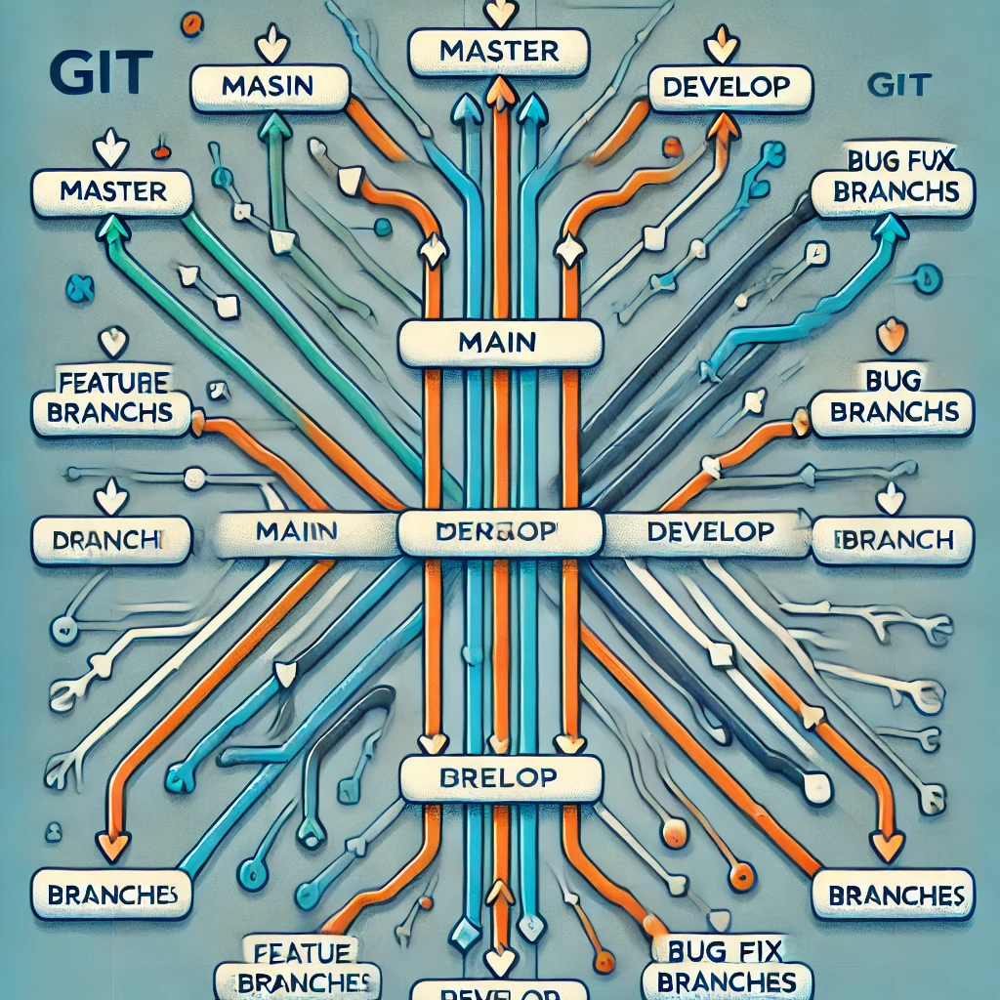

# 🌳 Ветвление в Git

## Что такое ветки?

Ветки в Git - это легковесные подвижные указатели на коммиты. Они позволяют разрабатывать функциональность изолированно от основной кодовой базы.

## 📋 Основные операции с ветками

### Создание и переключение
```bash
# Показать список веток
git branch

# Создать новую ветку
git branch <имя-ветки>

# Переключиться на ветку
git checkout <имя-ветки>

# Создать и переключиться одной командой
git checkout -b <имя-ветки>
```

### Слияние веток
```bash
# Слить указанную ветку в текущую
git merge <имя-ветки>

# Слияние с созданием коммита слияния
git merge --no-ff <имя-ветки>
```

## 🔄 Перебазирование (rebase)

```bash
# Перебазировать текущую ветку
git rebase <целевая-ветка>

# Интерактивное перебазирование
git rebase -i HEAD~3
```

## 👥 Рекомендуемые практики

1. **Используйте осмысленные имена веток:**
   - `feature/добавление-авторизации`
   - `bugfix/исправление-валидации`
   - `hotfix/критическая-ошибка`

2. **Регулярно обновляйте ветки:**
   ```bash
   git checkout main
   git pull
   git checkout your-branch
   git rebase main
   ```

## 📊 Стратегии ветвления



### Git Flow
- `main` - стабильная версия
- `develop` - разработка
- `feature/*` - новые функции
- `release/*` - подготовка релиза
- `hotfix/*` - срочные исправления

[⬅️ Назад к основным командам](basic-commands.md) | [Вперед к удаленным репозиториям ➡️](remote-repos.md) 