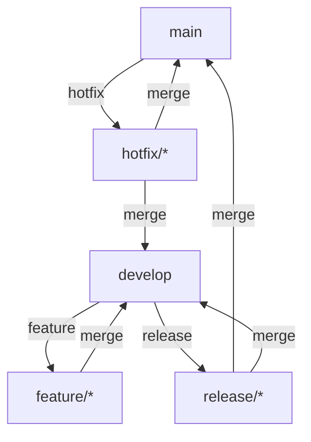

# 🌊 Git Flow

## 📋 Что такое Git Flow?

Git Flow - это популярная модель ветвления, которая определяет строгую структуру веток для управления разработкой проекта.

## 🌳 Основные ветки

### Постоянные ветки
- **main** (или master) - основная ветка с релизами
- **develop** - ветка разработки

### Временные ветки
- **feature/** - для новых функций
- **release/** - для подготовки релиза
- **hotfix/** - для срочных исправлений
- **bugfix/** - для исправления ошибок

## 🔄 Жизненный цикл

### 1. Разработка новой функции
```bash
# Создание ветки функционала
git checkout develop
git checkout -b feature/новая-функция

# После завершения разработки
git checkout develop
git merge --no-ff feature/новая-функция
git branch -d feature/новая-функция
```

### 2. Создание релиза
```bash
# Создание ветки релиза
git checkout develop
git checkout -b release/1.0.0

# Завершение релиза
git checkout main
git merge --no-ff release/1.0.0
git tag -a v1.0.0 -m "Версия 1.0.0"
git checkout develop
git merge --no-ff release/1.0.0
git branch -d release/1.0.0
```

### 3. Исправление критических ошибок
```bash
# Создание hotfix
git checkout main
git checkout -b hotfix/1.0.1

# Завершение hotfix
git checkout main
git merge --no-ff hotfix/1.0.1
git tag -a v1.0.1 -m "Версия 1.0.1"
git checkout develop
git merge --no-ff hotfix/1.0.1
git branch -d hotfix/1.0.1
```

## 📊 Схема работы 



### Пояснение к схеме:

1. **Основной поток:**
   - Разработка ведется в ветке `develop`
   - Функционал разрабатывается в ветках `feature/*`
   - Релизы готовятся в ветках `release/*`

2. **Порядок слияния:**
   - `feature/*` → `develop`
   - `develop` → `release/*`
   - `release/*` → `main` и `develop`
   - `hotfix/*` → `main` и `develop`

3. **Правила именования веток:**
   - `feature/имя-функции`
   - `release/номер-версии` (например, release/1.2.0)
   - `hotfix/номер-патча` (например, hotfix/1.2.1)
   - `bugfix/описание-бага`

4. **Теги:**
   - Каждый релиз в `main` помечается тегом версии
   - Формат: v1.2.3 (где 1 - мажорная версия, 2 - минорная, 3 - патч)